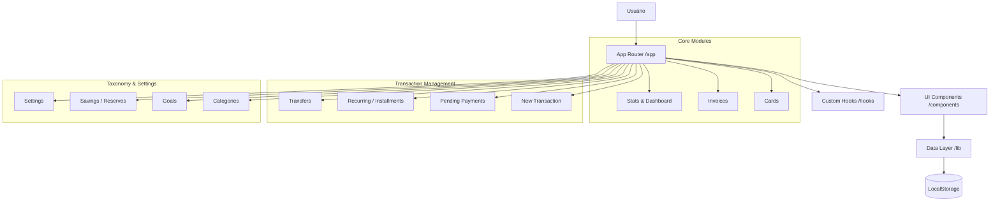

# Dominio - Personal Finance Dashboard

  

**Dominio** é uma aplicação de gestão financeira pessoal focada em controle de cartões, faturas, metas de economia e categorização de gastos. O sistema opera atualmente com persistência local (LocalStorage), ideal para uso pessoal imediato ou demonstração de MVP.

## 🚀 Quick Start

Execute o projeto localmente em menos de 2 minutos:

```bash
# Instalar dependências
npm install

# Rodar servidor de desenvolvimento
npm run dev
```

Acesse [http://localhost:3000](http://localhost:3000).

---

## 🏗 Architecture Graph

A arquitetura segue o padrão **Next.js App Router** com uma camada de dados abstraída em `lib/storage`.



---

## 🔑 Environment Variables

Atualmente, o projeto não requer variáveis de ambiente para execução local, pois utiliza persistência no navegador.

| Key | Description | Required |
| --- | ----------- | :------: |
| - | Nenhuma variável necessária no momento | N |

---

## 📚 Index de Funcionalidades

Abaixo a documentação completa dos 13 módulos do sistema:

### 核心 Core & Dashboard

| Módulo | Descrição | Status |
| :--- | :--- | :--- |
| **[Login](./app/login/README.md)** | Autenticação local e onboarding | ✅ |
| **[All Menus](./app/all-menus/README.md)** | Sitemap visual de navegação | ✅ |
| **[Stats](./app/stats/README.md)** | Dashboard analítico, gráficos e projeções | ✅ |

### 💳 Gestão de Contas & Cartões

| Módulo | Descrição | Status |
| :--- | :--- | :--- |
| **[Cards](./app/cards/README.md)** | Gestão de cartões de Crédito e Débito | ✅ |
| **[Invoices](./app/invoices/README.md)** | Faturas de cartão, pagamento e histórico | ✅ |
| **[Transfer](./app/transfer/README.md)** | Transferência de saldo entre contas | ✅ |

### 💸 Transações

| Módulo | Descrição | Status |
| :--- | :--- | :--- |
| **[New](./app/new/README.md)** | Criação rápida de transações | ✅ |
| **[Pending](./app/pending/README.md)** | Contas a Pagar/Receber e Baixas | ✅ |
| **[Recurring](./app/recurring/README.md)** | Assinaturas e Parcelamentos futuros | ✅ |

### 🎯 Planejamento & Taxonomia

| Módulo | Descrição | Status |
| :--- | :--- | :--- |
| **[Categories](./app/categories/README.md)** | Categorização e orçamentos | ✅ |
| **[Goals](./app/goals/README.md)** | Metas de economia (Gamificação) | ✅ |
| **[Savings](./app/savings/README.md)** | Envelopes de reservas financeiras | ✅ |
| **[Settings](./app/settings/README.md)** | Configurações globais e Perfil | ✅ |
